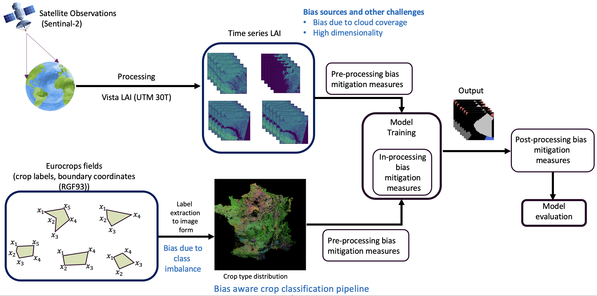
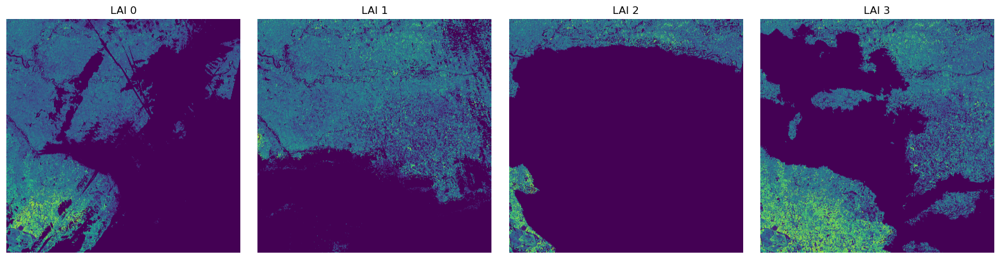
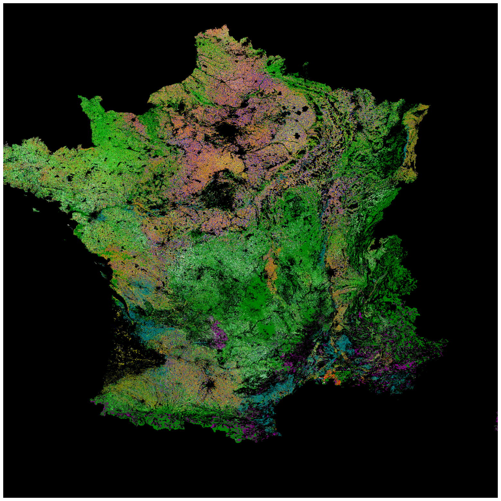
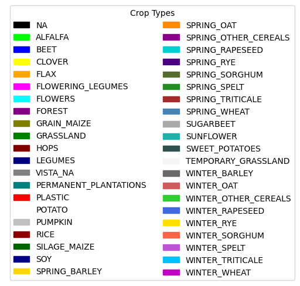
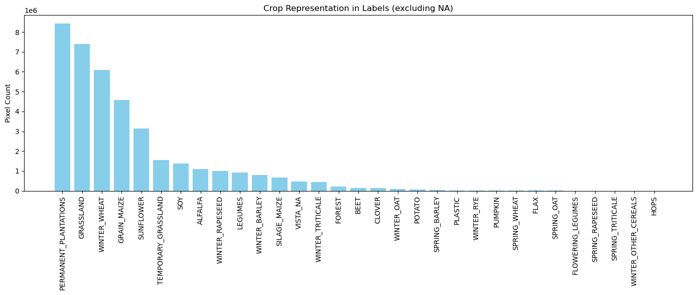

# crop_prediction_tool


This repository runs an end-to-end crop-type classification workflow that:

	1.	downloads LAI rasters, labels, and trained models from MinIO
	2.	runs spatio-temporal inference and evaluation
	3.	uploads metrics, plots, and GeoTIFFs back to MinIO

You can launch the whole pipeline from the Jupyter notebook `crop_classification_remote.ipynb` (recommended). The notebook triggers main.py under the hood.


### Bias-aware crop classification pipeline



## Overview

main.py orchestrates MinIO I/O, model ensemble loading, monthly evaluations, subgroup aggregation, patch-level evaluation, and report creation using helpers in vista_patch_exp0:

	1. evaluate_months(...)
	2. LAI_period_sampler(...)
	3. subgroup_aggregator(...)
	4. patch_evaluator(...)
	5. write_eval_results()

It expects:

	1. LAI raster .tif time series
	2. spatial labels .npy
	3. a list of trained .h5 models
	5. region/window parameters and crop groups for multiple seasonal windows


## Installations required(package requirements/dependencies)


<pre>
    conda config --set channel_priority strict && \
    conda tos accept --override-channels --channel https://repo.anaconda.com/pkgs/main && \
    conda tos accept --override-channels --channel https://repo.anaconda.com/pkgs/r && \
    conda create -y -n $CONDA_ENV python=3.11 && \
    conda activate $CONDA_ENV && \
    conda install -y -c conda-forge cudatoolkit=11.8 && \
    pip install nvidia-cudnn-cu11==8.6.0.163 && \
    conda install -y -c conda-forge tensorflow=2.13 && \
    pip install classification-models-3D==1.0.10 && \
    pip install efficientnet-3D==1.0.2 && \
    pip install segmentation-models-3D==1.0.7 && \
    pip install minio && \
    conda install -y -c conda-forge scikit-learn==1.5.0 && \
    conda install -y -c conda-forge matplotlib && \
    pip install patchify==0.2.3 && \
    conda install -y -c conda-forge scikit-image==0.24.0 && \
    conda install -y -c conda-forge rasterio sqlite gdal pyproj fiona geopandas && \
    conda install -y -c conda-forge opencv && \
    conda clean --all --yes"
</pre>


### How the data flows

1. **Download from MinIO**
   - **LAI rasters** → `./dataset/france2/processed_lai_npy2/*.tif`
   - **Labels** → `./storage/full_mast1/vista_labes_aligned.npy`
   - **Models** → `./checkpoints_f1/*.h5`

2. **Run evaluations & aggregations**
   - Per-season window evaluation (`Feb_Aug`, `May_Aug`, `Jun_Oct`, `Jan_Aug`)
   - Crop-group sampling and subgroup aggregation
   - Patch-based evaluator over a chosen number of random patches

3. **Write local results**
   - `./evaluation_results/*`
   - `./aggregated_predicted_*.tif`
   - `./vista_patch_exp0/aggregated_plots_f1_gt/*`

4. **Upload to MinIO (final outputs)**
   - Confusion matrix, metrics, plots, and aggregate GeoTIFFs → your specified `output.predictions` S3 path


### Run options

#### A) Recommended: via Jupyter notebook

Open and run **`crop_classification_remote.ipynb`**.  
It sets up the environment and automatically executes `main.py` with your chosen `input.json` and `output.json` files.

#### B) CLI: run `main.py` directly

```
python main.py input.json output.json
```

### Input JSON schema

Below is an example of a valid input configuration file (`input.json`):

```json
{
  "input": {
    "lai_files": [
      "s3://vista-bucket/Pilot_B/UCB2/33UUP/TIMESERIES_EXTRACTION_GROUND_TRUTH/lai_field_timeseries.csv"
    ],
    "npk_values": [
      "s3://abaco-bucket/MATCH/user_NPK_values.csv"
    ],
    "actual_LAI": [
      "s3://vista-bucket/Pilot_B/UCB/trial_lai/30TYQ_LAI_2022_measure_00.tif",
      "... more .tif files ..."
    ],
    "spatial_labels": [
      "s3://vista-bucket/Pilot_B/UCB/30TYQ_labels/vista_labes_aligned.npy"
    ],
    "models_in_ensemble": [
      "s3://vista-bucket/Pilot_B/UCB/models/3D_unet_g4_h4_crop_21_23_28_epoch_f.h5",
      "... more .h5 models ..."
    ]
  },
  "parameters": {
    "months_chosen": ["Feb_Aug", "May_Aug", "Jun_Oct", "Jan_Aug"],
    "upper_left_x": 704855.0,
    "upper_left_y": 4995145.0,
    "pixel_size": 10.0,
    "crs_code": "EPSG:32630",

    "Feb_Aug_crop_group": [33, 36, 41, 34, 37, 40],
    "Feb_Aug_subgroup1": [34, 37, 40],
    "Feb_Aug_subgroup2": [33, 36, 41],

    "May_Aug_crop_group": [2, 15, 20, 21, 23, 28],
    "May_Aug_subgroup1": [2, 25, 20],
    "May_Aug_subgroup2": [21, 23, 28],

    "Jun_Oct_crop_group": [8, 30, 9, 18, 19, 7],
    "Jun_Oct_subgroup1": [8, 9, 30],
    "Jun_Oct_subgroup2": [7, 18, 19],

    "Jan_Aug_crop_group": [4, 7, 9],
    "Jan_Aug_subgroup1": [4, 7, 9],

    "num_eval_patches": 300
  },
  "minio": {
    "endpoint_url": "https://minio.stelar.gr",
    "id": "",
    "key": "",
    "skey": ""
  },
  "output": {
    "predictions": "s3://vista-bucket/Pilot_B/UCB/outputs/"
  }
}
```

### Key sections

#### **`input`**
Paths to data and models stored in **MinIO**:
- **`actual_LAI`** — list of LAI raster `.tif` files  
- **`spatial_labels`** — `.npy` label array  
- **`models_in_ensemble`** — trained model `.h5` files  


#### LAI time series




#### Labels extracted from Eurocrops field boundaries and HCAT crop IDs over the whole of France



#### Labels extracted from Eurocrops field boundaries and HCAT crop IDs over chosen vista patch

<div style="display: flex; justify-content: center; gap: 20px;">
  
  
</div>


#### Distribution of crop types over the chosen landscape 



#### **`parameters`**
Spatial metadata and crop grouping:
- **Geographic extent** — `upper_left_x`, `upper_left_y`, `pixel_size`, `crs_code`  
- **Seasonal windows** — `months_chosen`  
- **Crop and subgroup definitions** — defined for each seasonal window  
- **`num_eval_patches`** — number of random patches used for evaluation  

#### **`minio`**
Connection configuration for the **MinIO** endpoint:  
Replace empty strings with your actual credentials (`id`, `key`, `skey`).

#### **`output`**
Specifies the **S3 destination** where all generated outputs will be uploaded.


### Outputs

After a successful run, these files are uploaded to **`output.predictions`**:

- `crop_type_confusion_matrix.png`
- `evaluation_report.txt`
- `exp2_acc_no_cloud_interpol.png`
- `exp2_f1_no_cloud_interpol.png`
- `exp2_iou_no_cloud_interpol.png`
- `aggregated_predicted_Feb_Aug.tif`
- `aggregated_predicted_May_Aug.tif`
- `aggregated_predicted_Jun_Oct.tif`
- `aggregated_predicted_Jan_Aug.tif`
- `Feb_Aug_ground_truth_.png`, `Feb_Aug_predicted_.png`
- `May_Aug_ground_truth_.png`, `May_Aug_predicted_.png`
- `Jun_Oct_ground_truth_.png`, `Jun_Oct_predicted_.png`
- `Jan_Aug_ground_truth_.png` *(listed twice in code; only one will be uploaded)*

#### Local copies

Additional local copies of these files are stored in:

- `./evaluation_results/`
- `./vista_patch_exp0/aggregated_plots_f1_gt/`
- Project root for `aggregated_predicted_*.tif`